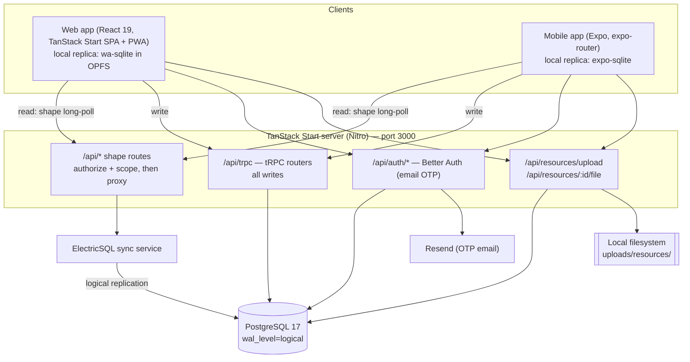
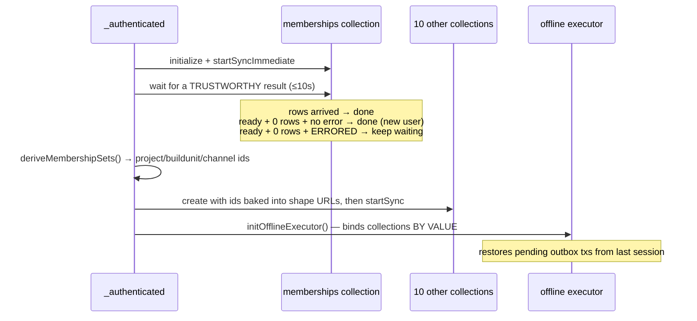

# BuildInLime — Architecture

> Status: **proof of concept.** This document describes the system **as it is built today**, derived from the code, not from an aspirational design. Where the implementation makes a deliberate compromise, it is called out in [Known constraints](#known-constraints).
>
> Earlier design-phase documents live in `web-app/design/` and `web-app/code/agentGuides/`. They describe the intended target; where they disagree with this document, this document reflects what actually runs.

---

## 1. What the system is

BuildInLime is a construction project-management application delivered as two clients — a React web app (also installable as a PWA) and a React Native / Expo mobile app — over one shared backend.

The defining architectural choice is that it is **local-first**. Every client holds a full local replica of the data it is allowed to see, in an on-device SQLite database. Reads never hit the network; they run against the local store. Writes are applied locally first and drained to the server through a durable outbox. Both apps remain fully usable offline, and the server is deliberately thin: a Postgres database, a sync service, an RPC endpoint for writes, and a file store.

### Domain vocabulary

The domain is a strict containment hierarchy:

```
Project → Build Unit → Channel → { Message (with threaded replies), Task }
```

A **Project** is a construction job. A **Build Unit** is a physical or logical piece of it. A **Channel** is a workstream within a build unit, drawn from a fixed set of seven: Finance, Requirements, Design, Materials, Tools, Execution, Experimentation. Messages and tasks live in channels. **Resources** (uploaded files) attach to a channel, a message, or a task. **Properties** are a generic key/value system (priority, status, target date, percent complete, labels…) that can be attached to any entity in the hierarchy. **Teams** group users within a project. **Seen state** records per-user read state as a *timestamp marker* per (user, scope, scope id) — "seen up to time T in this scope" — so unread is "items newer than the marker," an O(scopes) check rather than the O(items) per-row scan the earlier `reads` collection required.

**Membership is the authorization primitive.** A row in `memberships` grants a user access to a channel (with a role of `owner`, `co-owner`, or `viewer`) and carries the denormalized `buildunit_id` and `project_id` alongside it. Everything a user can see is derived from their membership rows plus an "I own it" escape clause. This single table drives both server-side data scoping and client-side bootstrap, and its central role is the source of much of the complexity described in §6.

---

## 2. Repository layout

A pnpm workspace with five members:

| Path | Package | Role |
| --- | --- | --- |
| `web-app/code` | `buildinlime` | The web client **and** the entire backend. TanStack Start (Vite + Nitro) serves both. |
| `mobile-app` | `buildinlimemobile` | Expo / React Native client. Pure client — it has no server of its own. |
| `packages/domain-types` | `@buildinlime/domain-types` | Framework-free domain constants and types shared by both clients. |
| `packages/contracts` | `@buildinlime/contracts` | The wire contract, both directions: pure-zod tRPC input schemas for what a client **sends** (the server validates against them), pure-zod row schemas for what a shape **streams back** (both clients validate against them), plus a type-only tRPC router whose `typeof` is the `AppRouter` type mobile imports. See §5. |
| `packages/sync-core` | `@buildinlime/sync-core` | One copy of the client write layer — the optimistic action factories and the offline outbox's mutation-fns — plus the collection-options factory the read layer is built from. All parameterized by injected platform primitives. See §5 and §10. |

The `android/` and `ios/` directories at the **repo root are stale** — the live native projects are `mobile-app/android` and `mobile-app/ios`. Run Expo commands from `mobile-app/`.

Both clients follow the same four-layer internal structure, which is the main reason a developer can move between them:

```
domain/          Types and constants. No framework, no I/O.
application/     Collections (the local replicas) + actions (the write API).
infrastructure/  Auth, tRPC, persistence, offline executor, storage.
presentation/    Routes, pages, components, hooks.
```

The web app additionally hosts the server inside `infrastructure/` (database schema, tRPC routers, Better Auth) and `presentation/routes/api/` (the HTTP surface). This is unusual — server code sits under a directory named "presentation" — and is an artifact of TanStack Start's file-based routing, where API handlers must live in the routes tree.

---

## 3. System topology



The asymmetry is the point: **reads and writes take entirely different paths.** Reads stream out of Postgres through Electric's replication-driven sync protocol into the client's local database. Writes go in through tRPC, land in Postgres, and come *back* to the client through the sync stream. A client never reads its own write from the server — it reads it from its own local store, optimistically, and the server's version reconciles over the top when it arrives.

---

## 4. The read path: Electric shapes

Electric syncs *shapes* — a table plus a `where` clause. The client never talks to Electric directly. Every collection points at an `/api/<table>` route on the app server, and that route is where **authorization happens**.

Every shape route does the same three things, and does them in **one** place — `shapeHandler` in `infrastructure/database/shape-route.ts`:

1. `auth.api.getSession()` — reject with 401 if there is no session.
2. Build the Electric origin URL, forcing `table` and `where` server-side (`infrastructure/database/electric-proxy.ts`).
3. Proxy the response, stripping caching headers — shape responses are user-specific and must never be cached, and HTTP caching breaks Electric's handle+offset polling protocol.

The files under `presentation/routes/api/*.ts` are shells: a path and a descriptor, no logic. Every authorization rule lives together in `infrastructure/database/shapes.ts`, one `ShapeDef` per shape, which is the file to read (and to review) when you want to know what a table exposes and to whom. They were fifteen hand-written copies of the three steps above until they were collapsed; the copies had drifted, and the drift is what §4's history below describes.

The scope is resolved **server-side from the session, never from client input**. A descriptor declaring `scope: "member"` is handed the `{channelIds, buildunitIds, projectIds}` the user is entitled to — active membership OR ownership — from `resolveMemberScope()` (`infrastructure/database/access-scope.ts`), and builds its `where` from that set via `idSetWhere()`. **A user with no memberships gets `where 1 = 0`** — literally zero rows: a clean, if blunt, default-deny.

> **Why server-side, not client-supplied.** Routes used to take these id sets as `member_*_ids` query params and only check their UUID *format*. Format is not ownership: any authenticated user could pass someone else's ids and stream their rows — a broken-access-control / IDOR hole. It was closed in two passes. The first covered `tasks`, `resources`, `properties`, `projects`, `build_units`, and `channels`. That left four behind — `messages`, `channel_members`, `my_tasks`, and `inbox_mentions` — which kept reading client ids for some time afterwards while this document already described them as fixed. `messages` (every word of every channel) and `channel_members` (any channel's roster) were unbounded and fully exploitable; `my_tasks` and `inbox_mentions` were bounded by `assignee_id = me` / `mention_ids @> me`, so they leaked only rows already addressed to the caller, in channels they had lost access to. All four now resolve scope from the session like the rest. `memberships` was always safe (scoped `user_id = session.user.id`, a server-issued value) and keeps its stable self-stream.
>
> No shape reads an id set from the query string any more, and `tests/unit/shapes.test.ts` asserts it for every descriptor — feed each one a URL full of someone else's ids against an empty scope, and nothing may come back carrying them. The helper that made client-supplied lists survivable (`parseIdList`) was deleted along with its last caller. Clients still *send* `member_*_ids` / `channel_ids`; they are inert — the proxy never forwards them to Electric and no descriptor reads them — and they survive only because they key the clients' own collection rebuilds. Deleting them client-side is a follow-up.
>
> The one client-supplied value still in a `where` is `/api/buildunits`' `project_id`, a narrowing filter that is UUID-validated and AND-ed *inside* the access boundary, so it can only restrict what the session already permits.

Fourteen collections sync this way: `projects`, `build_units`, `channels`, `memberships`, `channel_members`, `users`, `teams`, `messages`, `tasks`, `resources`, `properties`, `seen_state`, `inbox_mentions`, `my_tasks`. The last three are tiny user-scoped slices that feed the always-mounted badges (web sidebar / mobile drawer); `seen_state` also replaced the old per-item `reads` collection on both apps (see §1).

Two scoping patterns coexist:

- **Owner-escape collections** (projects, build units, channels) are scoped `owner_id = me OR id = ANY(<server-resolved id set>)`. You always see what you own, even before anyone grants you membership.
- **Channel-scoped collections** (messages, tasks, resources, properties, channel members) have *no* owner escape hatch. They are scoped purely by the visible channel id set. This distinction matters enormously for the resync logic in §6.

### Soft deletes are not uniform, and that is deliberate

- **Tasks and resources** filter `deleted_at IS NULL` out of the shape. A deleted task simply vanishes from every client, so no call site has to remember to filter it.
- **Messages do not.** A deleted message keeps syncing, because replies hang off it via `parent_id`; dropping it from the shape would orphan every reply beneath it and silently destroy whole conversations. Instead, `messages.delete` **redacts the row in place** server-side — `text`, `mention_ids` and `resource_ids` are cleared — and the client renders a tombstone from `deleted_at`. What syncs is an empty husk, not the words. Clearing `mention_ids` also drops the message out of the Inbox and the unread badge for free.

The task table carries a partial unique index on `(channel_id, lower(name)) WHERE deleted_at IS NULL`. It is load-bearing, not cosmetic: **on web the URL *is* the task name**, so two tasks sharing a name made one of them unreachable. The `WHERE deleted_at IS NULL` predicate lets a deleted task release its name.

---

## 5. The write path: optimistic actions over a durable outbox

Every mutation in both apps flows through the same three stages.

```mermaid
sequenceDiagram
    participant UI
    participant Action as application/actions
    participant Coll as Local collection (SQLite)
    participant Outbox as offline-transactions outbox
    participant TRPC as tRPC router
    participant PG as Postgres
    participant Electric

    UI->>Action: createTask({...})
    Action->>Coll: onMutate — insert with client-generated UUID
    Coll-->>UI: renders instantly (optimistic)
    Action->>Outbox: enqueue mutation (persisted to SQLite)
    Note over Outbox: survives app restart; drains FIFO when online
    Outbox->>TRPC: mutationFn → trpc.tasks.create
    TRPC->>PG: INSERT ... ON CONFLICT DO NOTHING
    PG-->>Electric: logical replication
    Electric-->>Coll: authoritative row (reconciles by id)
```

The three moving parts:

- **`application/actions/*.ts`** is the write API the UI calls. Each action is an offline action bound to a named `mutationFn`, with an `onMutate` that applies the optimistic change to the local collection. Collections deliberately reject direct `.insert()`/`.update()` calls outside an offline transaction — the resulting "no handler" error is the intended loud failure mode. The action *logic* lives once in `@buildinlime/sync-core` (`makeTaskActions`, `makeMessageActions`, …); each app's action file is a thin shim that binds a factory to its own executor and collection, injecting only what differs — the UUID source (`crypto` vs `expo-crypto`) and getters for the app's executor/collection (§10).
- **`infrastructure/offline/mutation-fns.ts`** maps each `mutationFnName` to the tRPC call that replays it against the server. This is the only place tRPC is called from the client. Its logic also lives once in `sync-core` (`makeCoreMutationFns(trpc)`); web's file *is* the shared spine, and mobile's composes it with the few entities only it writes through the outbox (projects, build units, channels).
- **`infrastructure/trpc/routers/*.ts`** applies the write in a transaction and returns a Postgres `txid` for Electric correlation. Every router validates its input against a shared pure-zod schema from `@buildinlime/contracts` rather than an inline or drizzle-generated one, so the *same* schema defines what the server accepts and (via §10's `AppRouter` type) what the clients are allowed to send.

Three properties make this safe:

**Client-generated ids.** Every entity's primary key is a UUID minted on the client at `onMutate` time. This is what makes the whole scheme work: the optimistic row and the server row are *the same row*, so Electric reconciles by id with no reconciliation table, no id-swap, and no flicker.

**Idempotency everywhere.** Every create is `ON CONFLICT DO NOTHING` + re-select; every delete is a no-op if already deleted. The outbox retries, and a retry must never double-insert or 500.

**Non-retriable errors fail fast.** The outbox drains **strictly in order and retries retriable errors forever**, so an error the server will *never* accept would wedge the queue and stall every write behind it. `BAD_REQUEST`, `UNAUTHORIZED`, `FORBIDDEN`, `NOT_FOUND`, `CONFLICT`, `PRECONDITION_FAILED`, `PAYLOAD_TOO_LARGE` and `UNPROCESSABLE_CONTENT` are therefore wrapped as `NonRetriableError` and dropped.

The one place that bends this rule is instructive. `createTask` catches `CONFLICT` (duplicate task name in a channel) and **auto-suffixes the name** — "Site Survey" → "Site Survey (2)" — retrying up to 50 times. The reasoning: the add form already blocks duplicates, so a conflict here means the task was created *offline* and someone took the name before it replayed. Failing would roll back the optimistic row and the user's work would silently vanish, with nobody around to be asked about it. Retrying is safe precisely *because* the id is client-generated and unchanged — only the name collided.

Authorization for writes is enforced in the tRPC routers against the database, independently of the shape scoping. `messages.delete`, for instance, checks `message.createdby_id === session.user.id` server-side.

---

## 6. The bootstrap: why login is more than a session check

This is the most intricate part of the system, and it is worth understanding before changing anything near it. It lives in `web-app/code/src/presentation/routes/_authenticated.tsx` (the mobile equivalent is in the tabs layout).

The problem: **the shape URLs depend on data that itself has to sync first.** A client cannot ask for its messages until it knows which channels it belongs to, and it learns that from the `memberships` shape. So collections cannot be created at module load — they are created by factory functions *after* memberships arrive, with the id sets baked into their URLs.



The trap the code goes out of its way to avoid: **`collection.isReady()` does not mean "synced".** The Electric collection library calls `markReady()` from its *error* path too — deliberately, so a failing shape cannot hang an app blocked on `preload()`. A memberships shape that 401s during a token refresh therefore lands instantly on "ready" with zero rows, which is indistinguishable from a brand-new user who genuinely belongs to nothing. Derive the id sets from that and every channel-scoped shape is built as `1 = 0`: no messages, no tasks, no resources **for the rest of the session** — while the owner-escape clause keeps projects and channels visible, so the app looks perfectly alive with every channel mysteriously empty.

So the bootstrap waits for a *trustworthy* result rather than a merely "ready" one, tracking shape errors out-of-band in `application/collections/_shared.ts`. The wait is bounded at 10s (login must never hang), and a one-shot re-derive after init acts as the backstop for memberships that land late.

### Resync

When the current user's own memberships change — they create a channel, or are added to or removed from one — the affected collections must be **rebuilt**, because their shape URL is immutable once created. Two change-detection keys decide what:

- **`visibilityKey`** (non-owner memberships only) → rebuilds projects / build units / channels. Creating something you *own* must not churn these, since the `owner_id = me` clause already covers it.
- **`channelKey`** (all visible channels) → rebuilds the channel-scoped collections, which have no owner escape hatch and so must react even when you create your own channel.

The rebuild must happen while the authenticated content is **unmounted** — `cleanup()` on a collection a mounted live query still references would tear the shape out from under it — so the layout renders a loading screen, resyncs, then re-keys the `<Outlet>` to remount against the fresh collections. The offline executor binds collections *by value*, so it is disposed and re-created too.

### Garbage collection: idle-GC as a lever for closing idle shape streams

TanStack DB's GC fires when a collection has no mounted live query, and its cleanup **aborts the Electric long-poll** — so GC is precisely the lever for closing an idle shape stream.

This used to be blanket-disabled (`gcTime = Infinity`) everywhere, on the claim that "sync is started once and never restarted, so a GC'd collection goes permanently silent." **That is no longer true.** Verified against `@tanstack/db@0.6.5`: `changes.addSubscriber()` calls `sync.startSync()` whenever a collection in status `cleaned-up` (or `idle`) gains a subscriber, and the lifecycle allows the `cleaned-up → loading` transition. A GC'd collection therefore **resurrects the moment a live query subscribes to it again**, and — because every collection is wrapped in `persistedCollectionOptions` — the restart **resumes from the persisted offset (`changes_only`, in OPFS on web / expo-sqlite on mobile)** rather than refetching the whole shape. Cheap.

So GC is no longer redundant-and-harmful; it is a deliberate tool, and collections fall into two tiers:

- **`NEVER_GC` (`Infinity`)** — collections an *always-mounted* subscriber holds for the whole session, so GC would never fire anyway. The persistent web `<Sidebar>` — and the mobile Drawer's `DrawerContent` — keep the spine (`projects`, `build_units`, `channels`, `users`, `teams`) subscribed; their always-mounted badges keep the tiny user-scoped `seen_state`, `inbox_mentions` and `my_tasks` slices subscribed. (Those three badge slices *replaced* the old full-collection unread scans — that rework is exactly what freed the heavy collections below to idle.)
- **`IDLE_GC_MS` (60s)** — heavy, screen-scoped collections that genuinely go idle. `messages`, `tasks`, `properties` and `resources` are subscribed only by the channel / build-unit / task / inbox routes; nothing always-mounted holds them. They stream only while such a view is open, close their long-poll 60s after the last live query unmounts, and resurrect + resume from the persisted offset (OPFS on web, expo-sqlite on mobile) on the next visit. (`resources` was the last holdout on both apps — and on mobile it was also the one collection not yet persisted, which had to be fixed first, since idle-GC without persistence refetches the whole shape on every resurrection.)

**Both apps implement this two-tier model, and it pays off more on mobile** for two compounding reasons web doesn't get: (1) the drawer/leaf-screen navigation idles collections *constantly* — a channel closed, a sheet dismissed — where web's persistent sidebar kept the spine warm and rarely idled, so GC actually gets to fire; and (2) mobile shapes are **project-scoped** (§10), so a resurrected shape resumes a project-bounded row set, and the live working set is bounded by *(current project × current screen)* — a two-dimensional reduction where web gets only the screen dimension.

The explicit `cleanup()` + rebuild on resync (above) is unchanged and orthogonal: it rebuilds collections whose *shape URL* must change because the membership-derived id set changed. Idle-GC closes and resumes the *same* shape; resync tears down and rebuilds a *different* one.

---

## 7. Local persistence

| | Web | Mobile |
| --- | --- | --- |
| Engine | `@journeyapps/wa-sqlite` (WASM) in **OPFS** | `expo-sqlite` |
| Adapter | `@tanstack/browser-db-sqlite-persistence` | `@tanstack/expo-db-sqlite-persistence` |
| File | `buildinlime.sqlite` | `buildinlime.sqlite` (WAL, `busy_timeout=5000`) |

The local database is **wiped on sign-out** on both platforms, so the next user on the same device never sees the previous user's cached rows on first paint. That wipe is best-effort on both — it can race in-flight Electric sync writes, and its failure is swallowed — so on its own it is not a correctness guarantee.

**A failed wipe is not a cosmetic problem, and only mobile is protected from it.** When the delete does not fully clear, the next session inherits the store *and its Electric sync offsets*. A stale offset makes Electric report "up-to-date" and never re-deliver, so every membership-scoped shape returns empty for the whole session — while projects still render through the `owner_id = me` escape hatch, which is why this shows up as "my build units vanished" rather than as an obviously broken app. Nothing self-heals it: no rows arrive, so the resync backstop never fires.

Mobile closes this on the way **in**. `ensureCleanPersistenceForUser` runs at the very top of bootstrap, before any collection opens the database, and wipes unless a marker in SecureStore matches `${userId}:${sessionId}`. Keying on the session id — not the user id alone — is what makes a re-login that never went through sign-out (app kill, expired session) still wipe, while a genuine session restore after an app restart matches and keeps the cache. Its branches are pinned in `mobile-app/tests/persistence-owner.test.ts`; the bug has now returned three times, each time through a path the previous fix did not cover.

**Web now does the same thing**, with `localStorage` in place of SecureStore and the wipe running at the top of `initCollections()` before any collection opens the store. Until that was ported, web had only the best-effort sign-out wipe and reproduced the original bug in full, with no recovery short of clearing OPFS by hand. Its wipe removes every OPFS entry whose name *starts with* `buildinlime.sqlite`, since the wa-sqlite VFS can leave journal/WAL companions and a wipe that leaves those behind is not a wipe; it is scoped to that prefix rather than emptying the OPFS root, which belongs to the whole origin. Cases are pinned in `web-app/code/tests/unit/persistence-owner.test.ts`, mirroring mobile's.

Both platforms share two fail-safes that are easy to get backwards. The session id is **not** part of the bootstrap's start condition — gating on it would leave a session shape that ever lacked one stranded on the loading screen instead of re-syncing. And an unknown login (no session id) writes **no** marker rather than `${userId}:`, which would match on the next load and reinstate precisely the hole being closed.

Two sharp edges are documented in the code and worth repeating:

**All collections must share one `schemaVersion`.** The persistence coordinator holds a single adapter shared across every collection, cached and keyed by `schemaVersion`. Bumping one collection's version spawns a *second* adapter that overwrites the coordinator's, driving the other collections' offset and data through the wrong namespace — Electric reports "up-to-date" while the local store has no rows and nothing renders. This has already happened once in this codebase. Every collection is currently at version 3. **If you bump one, bump them all.**

**Mobile keeps the upload queue in a separate database file.** Sharing the Electric persistence connection produced "database is locked" failures against Electric's sync transactions, so `pending_attachments` lives in its own SQLite file (`infrastructure/offline/pending-uploads-db.ts`).

---

## 8. Files and resources

Files are the one thing that does **not** go through the outbox — the outbox serializes each mutation to JSON, and multi-megabyte binaries have no business there.

Instead the **upload *is* the resource create.** The client POSTs multipart form data to `/api/resources/upload`; the server writes the bytes to disk, inserts the `resources` row (Electric-synced metadata) and a `resources_raw` row (server-only, holds the on-disk `storage_path`) in one transaction, and Electric syncs the new resource back to every client in the channel. Other clients see nothing until the upload completes; the uploading client sees the file immediately from local state.

Two details:

- The server **polls up to 15 seconds for the parent message or task to exist** before inserting. The parent row is created optimistically on the client and replayed through the outbox, so the upload can genuinely arrive first.
- **Downloads are authorized on every request.** `/api/resources/:id/file` re-checks the session, rejects soft-deleted resources, and verifies an active membership in the resource's channel. This is not belt-and-braces — the file outlives its soft delete on disk (a separate purge script is meant to reclaim the bytes on a delay, though it is not yet scheduled — see §12), and the resource id is not a secret: it survives in `messages.resource_ids` and in every client's local store from before the delete.

Mobile's upload manager (`infrastructure/offline/upload-manager.ts`) is a **singleton service, not a hook** — uploads must survive screen unmounts. It persists its queue to SQLite, copies picked files out of OS-managed temp directories into `documentDirectory` so a queued upload still has its bytes after an app restart, resumes interrupted uploads on launch, retries with exponential backoff, and supports *scheduled* uploads (defer a large file to a chosen time slot).

---

## 9. Authentication

**Better Auth** with the email-OTP plugin — passwordless, 6-digit code, 5-minute expiry, 5 attempts, sign-up disabled (invite-only). OTP delivery is via **Resend**; a delivery failure is thrown rather than swallowed, so the login form cannot cheerfully report "code sent!" when nothing was.

Sessions are stored in Postgres, with a **50-second signed cookie cache**. That number is chosen against this system's specific load: the Electric shape routes call `getSession()` on *every long-poll across every collection*, so caching takes the per-poll session read off the critical path (with ~20s long-polls, roughly 3× fewer session DB reads).

The tradeoff is documented candidly in `infrastructure/auth/server.ts` and is accepted **for the POC**: within the cache window, `getSession` trusts the cookie without consulting the database, so **session revocation lags by up to 50 seconds**. A de-authorized identity can keep streaming Electric data for that long. The blast radius is bounded — authorization is membership-driven and re-verified server-side per shape and per tRPC mutation, and the session only vouches for an immutable user id, so a stale cookie can *extend* an authenticated identity but never *elevate* it. Ban / "sign out everywhere" / password-reset flows should bypass the cache before this is treated as production-grade.

**Mobile has no cookie jar.** React Native's `fetch` neither persists cookies nor sends an `Origin` header (which Better Auth's CSRF protection requires). `infrastructure/auth/cookie-fetch.ts` supplies both: it stores session cookies in `expo-secure-store` and wraps `fetch` to attach `Cookie` + `Origin` on every request and to persist `Set-Cookie` from every response. `getAuthHeaders()` is exported as the single header-builder so the native file-transfer paths (`FileSystem.downloadAsync` / `uploadAsync`, which do their own networking and cannot use the wrapped fetch) cannot drift out of sync with it.

---

## 10. Web ↔ mobile: shared, parallel, divergent

**Genuinely shared** (one implementation, imported by both): the backend, the Postgres schema, the Electric shape routes, `@buildinlime/domain-types`, the wire contract in both directions (`@buildinlime/contracts` — the zod input schemas, the row schemas every synced row is validated against, and the `AppRouter` type), the client write layer (`@buildinlime/sync-core` — the optimistic action factories and the outbox's mutation-fns spine), and the collection-options factory the read layer is built from.

**How the write layer is shared without erasing the platform differences.** The action and mutation-fns *logic* is identical between the apps; only a handful of primitives genuinely differ, so `sync-core` exposes **factories** that take those primitives as parameters. An action factory (`makeTaskActions`) is injected with a `randomUUID` (Web Crypto vs `expo-crypto`) and *getters* for the app's executor and collection — getters, not values, because web rebuilds its collections and executor on resync/project-switch, and the memoized actions are reset to rebind, so reading through a getter always targets the current instance. `makeCoreMutationFns` is injected with the app's tRPC client, typed structurally as `inferRouterInputs<AppRouter>` from the contract — and because both routers now validate against the *same* contract schemas, each app's real client satisfies that shape, keeping the shared payloads type-checked. Each app's `application/actions/*.ts` and `infrastructure/offline/mutation-fns.ts` are reduced to thin wiring shims.

**How the read layer is shared.** The collection definitions used to be the largest parallel surface: every persisted Electric collection in both apps is the same sandwich — `createCollection(persistedCollectionOptions({...electricCollectionOptions({ id, shapeOptions, schema, getKey, gcTime, …handlers }), persistence, schemaVersion }))` — written out about a dozen times per app. Only four things genuinely differ *between* the apps (the persistence engine, the base URL, the timestamp/`int8` parser, and mobile's need for an explicit `fetchClient`), so those are injected once per app into `makeCollectionOptionsBuilder`, exactly as the action factories take their platform primitives. Each `collections/*.ts` now declares only what differs per *table*: id, shape path, the membership id sets to bake into the URL, schema, key, GC tier, and any mutation handlers.

The factory builds the **options only** — each app still calls `createCollection` itself, in the one-line `defineCollection` wrapper in its `_shared.ts`. That split is deliberate: the tanstack options types don't compose without an `as any`, and it is the app's own `createCollection` that turns that back into a properly typed `Collection`. Returning a finished collection from shared code would erase the row types at every call site. The `as any` that used to sit at all ~24 collection sites now sits at exactly two.

Two invariants became structural rather than documentary. `schemaVersion` is **not** a parameter — it is one constant in `sync-core`, because the persistence coordinator caches adapters keyed by it, and a single collection carrying a different value forks the cache and strands every other collection on reload (this actually happened when `properties` was bumped alone). And an empty membership id set omits its query parameter entirely rather than sending `?ids=`, because the shape routes read a missing parameter as "unscoped" — one place to get right instead of a dozen.

**The row schemas are shared too**, which closed the real drift risk. Both apps validate every synced row against the same pure-zod schemas in `contracts/schemas/rows.ts`. Previously web derived its own from drizzle (`createSelectSchema`) while mobile hand-wrote the equivalent, with nothing tying them together — and since **zod strips unknown keys**, a column missing from a schema is not merely untyped, it is *dropped from the row* and reads back `undefined` everywhere. Mobile's copy had already lost `properties.channel_id` and `properties.createdby_id` that way (latent only because no call site read them yet). The server now holds the contract to its tables: `database/schema/row-contract-assertions.ts` asserts every drizzle column is covered by the row schema, so a migration that adds a synced column fails the typecheck naming the column — subject to the caveat in §12.8.

The row schemas model the **wire**, not the Postgres types: a timestamp is `string | Date` (a `Date` fresh off Electric, a `string` once rehydrated from the local SQLite store), and jsonb enums pass through an `unwrapJsonb` preprocess. That preprocess is belt-and-braces — Electric's own `defaultParser` already maps `jsonb → parseJson` — but it is a no-op on an already-parsed value and covers the case where a shape carries no column metadata and the raw `'"High"'` arrives intact. Web's org schemas had no such guard and mobile's did; unifying on the safe direction resolved that quietly.

**Still parallel:** the *lifecycle* wiring around the definitions (deferred exports, init / reinit / reset, project-scoped rebuilds, `safeCleanup`) and the offline-executor wiring. These stay per-app because they are genuinely platform-entangled: web's persistence resolves asynchronously and mobile's synchronously, and mobile tears down and rebuilds its collections on project switch where web does not. The remaining per-app `_shared.ts` keeps only what differs (web's `origin`; mobile's `cookieFetch`, `safeCleanup`, and the Hermes timestamp `parser`). (The `CONFLICT` code that was once in mobile's non-retriable set and missing from web's can no longer diverge: both derive it from `domain-types`.) The lazy-load rework (timestamp `seen_state` replacing per-item `reads`, the `inbox_mentions` / `my_tasks` badge slices, and idle-GC on the heavy collections) was ported to mobile to keep the two collection layers in step; both now run it.

**Deliberately different:**

| | Web | Mobile |
| --- | --- | --- |
| Routing | TanStack Router (file-based, typed) | expo-router |
| UI | Tailwind v4 + Radix + MUI | NativeWind |
| Persistence | wa-sqlite / OPFS | expo-sqlite |
| Offline shell | Workbox service worker (precached app shell, `/api/*` always hits network) | native app |
| Connectivity | browser default | custom `OnlineDetector` over NetInfo |
| File uploads | browser `FormData` | singleton upload manager with a persisted queue |
| Auth transport | browser cookies | SecureStore + `cookie-fetch` wrapper |
| Collection scope | all member channels across **every** project at once | the **selected** project's channels only, rebuilt on project switch |
| "Mark seen" trigger | page unmount (`useEffect` cleanup) | screen **blur** (`useFocusEffect` cleanup) — the Drawer keeps screens mounted, so unmount never fires |

The **collection-scope** difference is load-bearing for §6's resync and for the GC section above: mobile derives its channel-scoped shapes from the *selected* project's memberships, so switching projects tears down and rebuilds those collections, and a resurrected shape only ever spans one project.

The **mark-seen trigger** difference is a genuine platform trap: web pages unmount on navigation, so seen-markers fire from `useEffect` cleanup; mobile's Drawer keeps `inbox`/`my-tasks` mounted across navigation, so the same pattern left the badges stale — the marks must fire on blur via `useFocusEffect` instead.

Mobile's `OnlineDetector` exists because the library's built-in React Native detector notifies its listeners *before* updating its internal connected flag — the executor wakes, reads the stale offline value, and never schedules the retry, so transactions queued offline never drain on reconnect. The local implementation updates state first, then notifies, and is shared as a singleton between the executor and the upload manager.

Mobile's tRPC client is now typed with a real `AppRouter` imported from `@buildinlime/contracts`, so a server contract change breaks mobile at build time rather than silently at runtime. The `AppRouter` there is a *type-only* router: the contract assembles the procedures from the shared zod input schemas with stub resolvers, and mobile imports it with `import type`, so no server code (drizzle, Better Auth, the db connection) is dragged into the React Native bundle. It mirrors the surface mobile actually calls; the web client keeps using the server's own `typeof appRouter`. (This closed what earlier revisions of this document called "the single highest-value cleanup available" — see §12.4.)

### What is left to share — a survey

The write layer, the row schemas and the collection definitions are done (above). The presentation layer has had its own modularization pass. What follows is the remaining surface, **ordered by value, not by size**, from a sweep of both apps' non-presentation layers. None of it is urgent; all of it is real.

**1. Cross-client React hooks.** Three hooks are byte-identical between the apps apart from import paths and comma style: `useSeen` (79 lines each), `useInboxBadge` (37/38) and `useMyTasksBadge` (40/39) — about 156 duplicated lines whose comments already instruct the reader to *"keep the two in step"* by hand.

This is shareable for a reason that does not hold for components: **both clients are React, on the same pinned `@tanstack/react-db` (0.1.83) and the same React 19.2**, and these three hooks touch nothing but React, `useLiveQuery`, and better-auth's `useSession` — no DOM, no React Native. A `@buildinlime/client-hooks` package would expose one factory (`makeSeenHooks`) taking `useSession`, the three collection **getters**, and `markSeenAction`; the badge hooks consume `useSeen` internally, so all three must come from a single factory call. `coerceBool` needs no injection — it already comes from `sync-core`.

Getters, not values, for the reason given above for the action factories: web reassigns its collection module-`let`s on resync, and a hook holding the captured instance would keep reading a dead collection while the badges silently stopped updating. `react` and `@tanstack/react-db` must be **peerDependencies** — a second React copy resolved under Metro is an `Invalid hook call` that appears only on device.

The line saving is negligible (~30 net). The reason to do it is that the badge semantics are subtle and fail *silently*: `useMyTasksBadge` carries a warning that Electric delivers booleans as the **string** `"false"` on synced rows, so a bare `!t.completed` reads truthy and pins the badge at zero. That trap is documented in two copies today; fix one and the other keeps the bug, with no test and no type error to say so. Worth doing the next time seen/badge logic is touched.

Two tiers below that are **not** worth doing yet. Mobile has thin per-table query hooks (`useTasks`, `useMessages`, `useChannels`, `useProjects`, …, 7–28 lines) where web inlines the same live queries inside larger hooks like `use-channel-page` — duplicated *queries*, not duplicated code, and unifying them means restructuring web's hooks first. And a third group is platform-bound by nature: web's `use-channel-page` / `use-task-route` bind to TanStack Router, `use-build-unit-channels` imports `lucide-react`; mobile's `useResourceDownload` uses `expo-file-system` and RN `Alert`.

**2. The upload stack — the largest remaining duplication.** Mobile's `upload-manager.ts` (511) + `pending-uploads-db.ts` (174) against web's `use-pending-resources.ts` (331) + `pending-resources-db.ts` (73). The retry/backoff numbers and status vocabulary are already shared (`sync-core/upload-policy.ts`); the **state machine** — enqueue, schedule, hydrate, retry, cancel — is written twice.

They are also architecturally divergent in a way worth deciding on deliberately rather than by accident: mobile is a **singleton service** that survives screen unmount, web is a **hook** that dies with its component. Extracting the queue state machine over injected ports (storage: IndexedDB vs SQLite; file handle: `File` vs a `documentDirectory` URI; transport) is the right shape, and web probably wants the service form regardless. This is the most work and the most risk of the items here — do it after the hooks, and only with the §12.10 orphan-copy problem in view, since both live in the same code.

**3. The `domain/` layer is vestigial.** `web-app/code/src/domain/` is 46 lines of pure re-export from `@buildinlime/domain-types`; mobile has no `domain/` directory at all, despite §2's diagram showing one for both. The rules that *would* live there are instead enforced twice: `trpc/routers/tasks.ts` enforces "only the creator may assign or delete a task" server-side, and the clients re-implement the same predicate to decide whether to render the button. Moving predicates like `canAssign(task, userId)` into `domain-types` would give the server and both clients one copy — small, mechanical, and it removes a class of drift where the UI offers an action the server will refuse.

**4. Action-module resets — RESOLVED.** Mobile had an `actions/index.ts` barrel whose `resetAllOfflineActions()` covered all five of its action modules; web had none, and `signOutAndDispose` enumerated the resets by hand and had drifted to five of six — `resetSeenActions` was exported and never called anywhere, so `markSeenAction` kept its binding to the signed-out session's executor and collection while the other five were cleared. Web now has the same barrel, and `tests/unit/action-resets.test.ts` asserts the property that actually broke: every module in the actions **directory** is both imported by the barrel and called inside `resetAllOfflineActions`. A behavioural test would not have caught the original bug, since it would only cover the modules its author already knew about. The guard is web-only — mobile's barrel is complete today but has no equivalent test, which is the remaining asymmetry.

**5. `/api/reads` is dead.** `seen_state` replaced the per-item `reads` collection on both apps (§1); nothing imports a reads collection any more and the only surviving references are the route, its descriptor, and the generated `routeTree`. Route and descriptor should go together.

---

## 11. Environments and deployment

Local development runs Postgres 17 (`wal_level=logical`) and the ElectricSQL service via `docker-compose` (`pnpm backend:up`), with the app on port 3000. **Caddy** fronts it at `https://localhost:5173` because service workers, OPFS and secure cookies all want a real HTTPS origin. Migrations are Drizzle Kit (`pnpm migrate`).

Mobile talks to the dev machine over the LAN; `scripts/set-lan-ip.sh` writes the host IP into the Expo env, and the server's `trustedOrigins` accepts `MOBILE_ORIGIN` plus `10.0.2.2` (the Android emulator's host alias).

There is **no deployed production environment in the repo.** `sst` is present as a devDependency with no config committed, and Electric runs with `ELECTRIC_INSECURE: true`, which its own documentation flags as unsuitable for production.

---

## 12. Known constraints

These are the things to fix before this stops being a POC. Every one of them is a conscious decision recorded in the code, not an oversight.

1. **File storage is the local filesystem.** `uploads/resources/` under the server's working directory. This pins the backend to a single machine — it cannot be horizontally scaled or serverless-deployed without moving to object storage.
2. **Session revocation lags up to 50 seconds** (§9). Ban, sign-out-everywhere, and password-reset need a cache-bypass path.
3. **Electric runs insecure** in the compose file. Production needs Electric's gatekeeper/auth configuration.
4. **Mobile tRPC types — RESOLVED.** Mobile was typed `AppRouter = any`, so a server contract change broke it silently at runtime. It now imports a real, type-only `AppRouter` from `@buildinlime/contracts` (§10), so such a change fails `pnpm typecheck`. Remaining gap: the contract router mirrors the surface mobile calls rather than being the *identical* object the server exports, so a procedure the server renames/removes is caught by the shared *input schemas* but not structurally on the router shape.
5. **Client-logic duplication — RESOLVED for the read and write layers.** The actions layer, the mutation-fns spine, the collection helpers, the non-retriable-code set, the **per-table collection definitions** (via `makeCollectionOptionsBuilder`) and the **row schemas** every synced row validates against are now single-sourced in `@buildinlime/sync-core` / `@buildinlime/domain-types` / `@buildinlime/contracts` (§10). That closed the drift class that had already produced both the `CONFLICT` divergence and mobile's silently-dropped `properties.channel_id`. Still per-app, deliberately: the collection *lifecycle* wiring (init/reset, project-scoped rebuilds) and the offline-executor wiring, which are genuinely platform-entangled — web's persistence is async and mobile's sync, and only mobile rebuilds on project switch. Also still asymmetric: web's projects/build-units/channels writes go through collection `onInsert`/`onUpdate`/`onDelete` calling tRPC directly, while mobile routes the same writes through offline actions — so those three web write paths have no outbox behind them and are not offline-durable. That is the one piece of this constraint still open, and it is a behavioural gap rather than a duplication one — closing it means giving web the org actions mobile already has, in `sync-core` alongside the others. For the duplication that *does* remain — the badge hooks, the upload state machine, the vestigial `domain/` layer — see the survey at the end of §10.
6. **The txid handshake is skipped — but NOT for the reason previously recorded here.** `mutation-fns.ts` does not call `awaitTxId()` after a tRPC mutation. Earlier revisions of this document blamed an upstream limitation: that awaiting a txid "through a `persistedCollectionOptions`-wrapped Electric collection never resolves." **That explanation is wrong**, and the code disproves it four ways:

    - `awaitTxId(txId, timeout = 5000)` **cannot hang**. It rejects with `TimeoutWaitingForTxIdError` after five seconds; "never resolves, forever" is not a behaviour it has.
    - `utils` survives the wrapper. `persistedCollectionOptions` returns `{ ...syncOptions, sync: wrapped, persistence }`, and the spread carries `utils` with its original closure intact.
    - The wrapper cannot starve the txid store. Electric commits txids from its own stream handler — commented *"Always commit txids when we receive up-to-date, regardless of transaction state"* — independent of the persistence wrapper's `begin`/`write`/`commit`.
    - **Decisively: the handshake already runs through persisted collections in this app.** Web's projects / build-units / channels collections return `{ txid }` from their `onInsert`/`onUpdate`/`onDelete`, and electric-db-collection awaits it automatically (`wrappedOnInsert` → `processMatchingStrategy` → `awaitTxId`). Were the claim true, creating a project on web would stall 5s and roll back every time.

    Nor was it a version problem: `electric-db-collection@0.3.3` landed in the same commit that introduced `@tanstack/offline-transactions`, *before* the pilot that added the await and the commit that removed it. The library has not changed since.

    **What actually happened.** The pilot placed the await *inside* the `try/catch` that funnels into `wrapTrpcError`. A `TimeoutWaitingForTxIdError` carries no `.data.code`, so `wrapTrpcError` did not classify it as non-retriable and rethrew it as a plain `Error` — which the executor treats as **retriable**. It then re-ran the whole mutation-fn, re-issuing the tRPC call, and timed out again. Every symptom the old note described is that retry storm: the outbox entry never clears ("pending forever"), the FIFO queue grows behind it, and the retries starve the loop. The workaround removed a symptom of a mis-wired error path and attributed it to the library.

    **Still unknown:** why the txid was late enough to hit the 5s timeout at all. `tasksCollection.startSyncImmediate()` runs at bootstrap, so the stream should have been live — this was not settled, and settling it needs a running stack rather than a reading of the source.

    **Why it is nonetheless fine to leave skipped.** The handshake's only benefit is narrowing the window in which optimistic state is dropped before the synced row arrives; Electric reconciles by id regardless. No such flicker has ever been observed in this app, so the "brief, harmless window" holds on observation, not just assertion — the value of re-adding it is low.

    **If it is ever re-added**, two things are now required that were not true before. The await MUST sit outside the retriable path and a timeout MUST be swallowed: the server has already committed by then, so letting it retry re-issues the write, and letting it throw rolls back optimistic state for a mutation that in fact succeeded. And it must be skipped when the collection is not syncing — `tasks`, `messages`, `resources` and `properties` are now on `IDLE_GC_MS`, and GC aborts the shape's long-poll, so a replay against a GC'd collection has no stream to carry the txid and would time out every time. That hazard did not exist when the original pilot ran.
7. **No automated test coverage of the sync, bootstrap, or offline paths.** Vitest is configured; the intricate logic in §5 and §6 is currently protected only by its (excellent) comments.
8. **`pnpm typecheck` does not currently pass, so the type-level guarantees are unenforced.** The baseline is **137 errors on web** — 124 of them in `presentation/` (pages, hooks, components) — and **33 on mobile**. The shared packages are clean and gated at zero. Counts drift, so measure rather than trust this paragraph; `.github/quality-baseline.json` is the number CI actually enforces.

    This matters more than a tidiness backlog: several guarantees this document claims are *enforced by typecheck* — the mobile `AppRouter` contract (§12.4) and the row-contract assertions (§10) — fail the build on drift only against a baseline someone is watching. The ratchet (`.github/scripts/ratchet.sh`) is what makes that real today: it fails a PR whose count EXCEEDS the committed baseline, so the debt cannot grow while it is being paid down. It is only as good as the committed numbers, though — they sat at 224/34 against an actual 137/33 for a while, which is 93 errors of slack a regression could have hidden in. **Lower them whenever a count drops.**

    **Most of the web errors had one cause, and it is now fixed.** `CollectionSpec.schema` is typed `unknown`, `CollectionRuntime` types the injected tanstack builders as `(config: never) => object`, `buildCollectionOptions` therefore returns a bare `object`, and `defineCollection` ended in `createCollection(... as any)`. Four layers of erasure, so every collection's row type was lost and every `useLiveQuery` handed the UI `unknown` fields — 76 of the original 137 errors said "`unknown` is not assignable".

    Web's `defineCollection` now takes the row type explicitly (`defineCollection<MessageRow>`) and asserts it on the result. Typing all fourteen collections took the count from 117 to 37 in one sitting. **This entry previously claimed the opposite** — that restoring row types *adds* errors, citing attempts that produced 236, 302 and 258, and advising a budget of 250–300. That was wrong, and the reason is worth recording because it is an easy trap: `createCollection<T>`'s first type parameter is the **schema** (`T extends StandardSchemaV1`), not the row — the row is `InferSchemaOutput<T>`. Passing a row type there yields a garbage row type such as `{}` rather than an error, and every downstream property access then fails. The inflated counts were measuring that mistake, not the repair.

    Inference cannot reach the row type, and that is deliberate rather than an oversight to fix: `sync-core` avoids depending on the tanstack option types precisely so web and mobile can inject different persistence packages. The cost is that `defineCollection` asserts rather than infers, so a mismatched row type is a silent lie rather than a compile error. `tests/unit/collection-row-types.test.ts` closes the half of that which can be closed — it pins the schema each spec carries, which combined with `XRow = z.infer<typeof xRowSchema>` in contracts makes the pairing sound. Passing a mismatched row type at a call site remains convention.

    Typing the rows also RAISED the web lint baseline, 186 → 195, and that is deliberate rather than drift. Code written to cope with `unknown` — `?? []` fallbacks, `as unknown as string` casts, `if (!data) return` guards — is now provably dead, and `no-unnecessary-condition` says so. Most of it is safe to delete, but not all: `if (!seenStateCollection)` in `application/collections/communication.ts` guards a module binding declared `= null!`, so the assertion lies to the compiler and the guard is load-bearing. And `useLiveQuery`'s `data` is a getter over `collection.entries()` — always an array, never undefined — which means the `status: 'loading'` that `use-build-unit-channels` returns on `data === undefined` is **unreachable**, while two routes still branch on it. Untangling that is a behavioural change and belongs in its own commit, not bundled into a mechanical typing pass.

    **Mobile still has the untyped form** and its own 33 errors; the same change applies there and has not been made.
9. **The resource purge is never scheduled.** Soft-deleting a resource stamps `deleted_at` and stops serving the file, but the bytes are reclaimed only by `scripts/purge-resources.ts` (retention purge + orphan sweep), which is a manual, dry-run-by-default command with no cron, routine, or timer invoking it with `--apply`. Until it is scheduled, deleted files and orphaned uploads accumulate on disk indefinitely. Wiring up a periodic `pnpm purge:resources -- --apply` is future work.

    Note that this is **server disk** — `uploads/resources/` on the machine running the backend. It is unrelated to space on a user's device, and no user-facing action can close it: a button nobody presses reclaims nothing. Only a schedule does.

10. **Orphaned upload copies accumulate on mobile devices — DEFERRED.** A separate reclaim problem on the *other* disk, recorded here so the two are not conflated. Mobile's upload manager copies every picked file into `documentDirectory/pending-uploads/` so a queued upload survives a restart (`upload-manager.ts`), and deletes the copy on success, cancel and teardown. Those deletes are best-effort — every one is wrapped in `.catch(() => {})` — and an app kill between `remove(id)` and `deleteAsync` strands the file. So copies leak on the user's device, with nothing to sweep them: `initUploadManager` hydrates from the DB and never looks at the directory.

    The intended fix is a **Device Storage screen** reached from the drawer: a short note explaining that dangling upload copies can be cleared to free space, what they currently occupy, and a button to remove them. Detection is a clean diff — the filename IS the resource id (`${UPLOAD_DIR}${id}`), so `readDirectoryAsync` minus the `pending_attachments` rows minus the in-memory `uploads` map gives the orphan set.

    **It must have an age floor.** `enqueueUpload` copies the file BEFORE writing its row, so a sweep with no grace period would delete an upload that is mid-enqueue — the same hazard `purge-resources.ts` documents for the server, and the reason that script has `ORPHAN_GRACE_MINUTES`. Mirror it (60 minutes) rather than inventing a second answer.

    **Mobile only, deliberately.** Web has nothing equivalent to reclaim: it uploads straight through `FormData` with no queue, its resource previews are in-memory `URL.createObjectURL` blobs released on unload, and the service worker does not runtime-cache `/api/*`. Web's only device-side store is the OPFS replica, and clearing that forces a full re-sync and breaks offline use — a different feature with a real cost, not a cleanup. A "free up space" button on web would always reclaim zero bytes, so there deliberately isn't one.

---

## Appendix — where things live

| Concern | Path |
| --- | --- |
| Postgres schema | `web-app/code/src/infrastructure/database/schema/` |
| Migrations | `web-app/code/drizzle/` |
| Shape authorization rules (all of them) | `web-app/code/src/infrastructure/database/shapes.ts` |
| Shape route handler + `where` combinators | `web-app/code/src/infrastructure/database/shape-route.ts`, `shape-where.ts` |
| Shape route shells (path → descriptor) | `web-app/code/src/presentation/routes/api/` |
| Shape scope resolver (`resolveMemberScope`) | `web-app/code/src/infrastructure/database/access-scope.ts` |
| tRPC routers (write authorization) | `web-app/code/src/infrastructure/trpc/routers/` |
| Electric proxy | `web-app/code/src/infrastructure/database/electric-proxy.ts` |
| Auth config | `web-app/code/src/infrastructure/auth/server.ts` |
| File storage | `web-app/code/src/infrastructure/storage/fileStorage.ts` |
| Bootstrap / resync | `web-app/code/src/presentation/routes/_authenticated.tsx` |
| Collection definitions (web / mobile, still per-app) | `*/src/application/collections/*.ts` |
| Collection helpers — shared / per-app re-export | `packages/sync-core/src/collections.ts` / `*/src/application/collections/_shared.ts` |
| Actions — shared logic / per-app wiring | `packages/sync-core/src/actions/` / `*/src/application/actions/` |
| Mutation-fns — shared spine / per-app wiring | `packages/sync-core/src/mutation-fns.ts` / `*/src/infrastructure/offline/mutation-fns.ts` |
| Offline executor wiring (web / mobile, still per-app) | `*/src/infrastructure/offline/executor.ts` |
| Mobile upload manager | `mobile-app/src/infrastructure/offline/upload-manager.ts` |
| Wire contract (zod input schemas + `AppRouter` type) | `packages/contracts/src/` |
| Shared client layer (action + mutation-fns factories, collection helpers) | `packages/sync-core/src/` |
| Shared domain types | `packages/domain-types/src/` |
