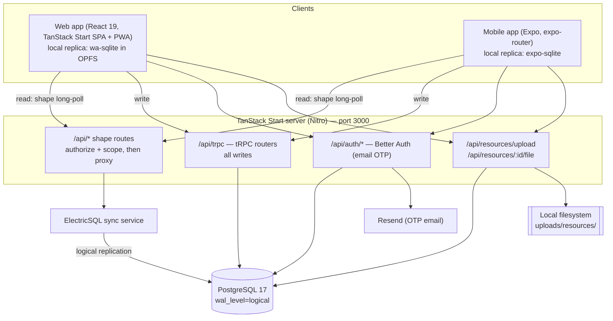
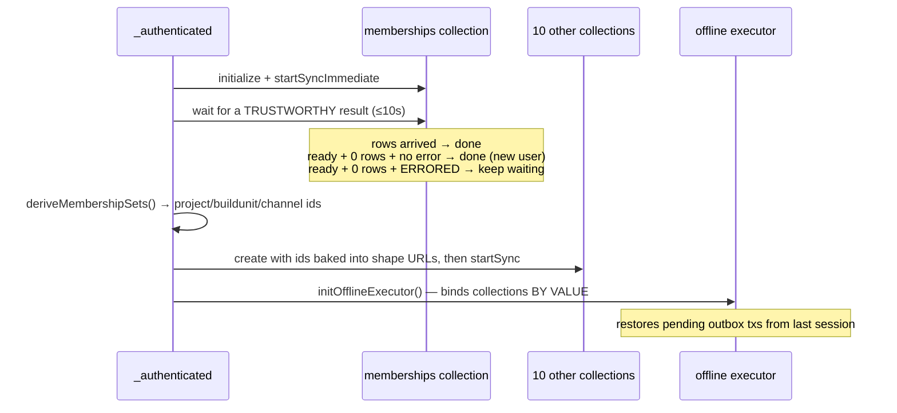

# BuildInLime — Architecture

> Status: **proof of concept.** This document describes the system **as it is built today**, derived from the code, not from an aspirational design. Where the implementation makes a deliberate compromise, it is called out in [Known constraints](#known-constraints).
>
> Earlier design-phase documents live in `web-app/design/` and `web-app/code/agentGuides/`. They describe the intended target; where they disagree with this document, this document reflects what actually runs.

---

## 1. What the system is

BuildInLime is a construction project-management application delivered as two clients — a React web app (also installable as a PWA) and a React Native / Expo mobile app — over one shared backend.

The defining architectural choice is that it is **local-first**. Every client holds a full local replica of the data it is allowed to see, in an on-device SQLite database. Reads never hit the network; they run against the local store. Writes are applied locally first and drained to the server through a durable outbox. Both apps remain fully usable offline, and the server is deliberately thin: a Postgres database, a sync service, an RPC endpoint for writes, and a file store.

### Domain vocabulary

The domain is a strict containment hierarchy:

```
Project → Build Unit → Channel → { Message (with threaded replies), Task }
```

A **Project** is a construction job. A **Build Unit** is a physical or logical piece of it. A **Channel** is a workstream within a build unit, drawn from a fixed set of seven: Finance, Requirements, Design, Materials, Tools, Execution, Experimentation. Messages and tasks live in channels. **Resources** (uploaded files) attach to a channel, a message, or a task. **Properties** are a generic key/value system (priority, status, target date, percent complete, labels…) that can be attached to any entity in the hierarchy. **Teams** group users within a project. **Seen state** records per-user read state as a *timestamp marker* per (user, scope, scope id) — "seen up to time T in this scope" — so unread is "items newer than the marker," an O(scopes) check rather than the O(items) per-row scan the earlier `reads` collection required.

**Membership is the authorization primitive.** A row in `memberships` grants a user access to a channel (with a role of `owner`, `co-owner`, or `viewer`) and carries the denormalized `buildunit_id` and `project_id` alongside it. Everything a user can see is derived from their membership rows plus an "I own it" escape clause. This single table drives both server-side data scoping and client-side bootstrap, and its central role is the source of much of the complexity described in §6.

---

## 2. Repository layout

A pnpm workspace with three members:

| Path | Package | Role |
| --- | --- | --- |
| `web-app/code` | `buildinlime` | The web client **and** the entire backend. TanStack Start (Vite + Nitro) serves both. |
| `mobile-app` | `buildinlimemobile` | Expo / React Native client. Pure client — it has no server of its own. |
| `packages/domain-types` | `@buildinlime/domain-types` | Framework-free domain constants and types shared by both clients. |

The `android/` and `ios/` directories at the **repo root are stale** — the live native projects are `mobile-app/android` and `mobile-app/ios`. Run Expo commands from `mobile-app/`.

Both clients follow the same four-layer internal structure, which is the main reason a developer can move between them:

```
domain/          Types and constants. No framework, no I/O.
application/     Collections (the local replicas) + actions (the write API).
infrastructure/  Auth, tRPC, persistence, offline executor, storage.
presentation/    Routes, pages, components, hooks.
```

The web app additionally hosts the server inside `infrastructure/` (database schema, tRPC routers, Better Auth) and `presentation/routes/api/` (the HTTP surface). This is unusual — server code sits under a directory named "presentation" — and is an artifact of TanStack Start's file-based routing, where API handlers must live in the routes tree.

---

## 3. System topology



The asymmetry is the point: **reads and writes take entirely different paths.** Reads stream out of Postgres through Electric's replication-driven sync protocol into the client's local database. Writes go in through tRPC, land in Postgres, and come *back* to the client through the sync stream. A client never reads its own write from the server — it reads it from its own local store, optimistically, and the server's version reconciles over the top when it arrives.

---

## 4. The read path: Electric shapes

Electric syncs *shapes* — a table plus a `where` clause. The client never talks to Electric directly. Every collection points at an `/api/<table>` route on the app server, and that route is where **authorization happens**.

Each shape route (`presentation/routes/api/*.ts`) does the same three things:

1. `auth.api.getSession()` — reject with 401 if there is no session.
2. Build the Electric origin URL, forcing `table` and `where` server-side (`infrastructure/database/electric-proxy.ts`).
3. Proxy the response, stripping caching headers — shape responses are user-specific and must never be cached, and HTTP caching breaks Electric's handle+offset polling protocol.

The client passes its membership-derived id sets as query params (e.g. `member_channel_ids`), the route validates them as UUIDs, and the `where` clause is built from them. **A user with no memberships gets `where 1 = 0`** — literally zero rows. This is a clean, if blunt, default-deny.

Fourteen collections sync this way: `projects`, `build_units`, `channels`, `memberships`, `channel_members`, `users`, `teams`, `messages`, `tasks`, `resources`, `properties`, `seen_state`, `inbox_mentions`, `my_tasks`. The last three are tiny user-scoped slices that feed the always-mounted sidebar badges; `seen_state` also replaced the old per-item `reads` collection (see §1).

Two scoping patterns coexist:

- **Owner-escape collections** (projects, build units, channels) are scoped `owner_id = me OR id = ANY(member ids)`. You always see what you own, even before anyone grants you membership.
- **Channel-scoped collections** (messages, tasks, resources, properties, channel members) have *no* owner escape hatch. They are scoped purely by the visible channel id set. This distinction matters enormously for the resync logic in §6.

### Soft deletes are not uniform, and that is deliberate

- **Tasks and resources** filter `deleted_at IS NULL` out of the shape. A deleted task simply vanishes from every client, so no call site has to remember to filter it.
- **Messages do not.** A deleted message keeps syncing, because replies hang off it via `parent_id`; dropping it from the shape would orphan every reply beneath it and silently destroy whole conversations. Instead, `messages.delete` **redacts the row in place** server-side — `text`, `mention_ids` and `resource_ids` are cleared — and the client renders a tombstone from `deleted_at`. What syncs is an empty husk, not the words. Clearing `mention_ids` also drops the message out of the Inbox and the unread badge for free.

The task table carries a partial unique index on `(channel_id, lower(name)) WHERE deleted_at IS NULL`. It is load-bearing, not cosmetic: **on web the URL *is* the task name**, so two tasks sharing a name made one of them unreachable. The `WHERE deleted_at IS NULL` predicate lets a deleted task release its name.

---

## 5. The write path: optimistic actions over a durable outbox

Every mutation in both apps flows through the same three stages.

```mermaid
sequenceDiagram
    participant UI
    participant Action as application/actions
    participant Coll as Local collection (SQLite)
    participant Outbox as offline-transactions outbox
    participant TRPC as tRPC router
    participant PG as Postgres
    participant Electric

    UI->>Action: createTask({...})
    Action->>Coll: onMutate — insert with client-generated UUID
    Coll-->>UI: renders instantly (optimistic)
    Action->>Outbox: enqueue mutation (persisted to SQLite)
    Note over Outbox: survives app restart; drains FIFO when online
    Outbox->>TRPC: mutationFn → trpc.tasks.create
    TRPC->>PG: INSERT ... ON CONFLICT DO NOTHING
    PG-->>Electric: logical replication
    Electric-->>Coll: authoritative row (reconciles by id)
```

The three moving parts:

- **`application/actions/*.ts`** is the write API the UI calls. Each action is an offline action bound to a named `mutationFn`, with an `onMutate` that applies the optimistic change to the local collection. Collections deliberately reject direct `.insert()`/`.update()` calls outside an offline transaction — the resulting "no handler" error is the intended loud failure mode.
- **`infrastructure/offline/mutation-fns.ts`** maps each `mutationFnName` to the tRPC call that replays it against the server. This is the only place tRPC is called from the client.
- **`infrastructure/trpc/routers/*.ts`** applies the write in a transaction and returns a Postgres `txid` for Electric correlation.

Three properties make this safe:

**Client-generated ids.** Every entity's primary key is a UUID minted on the client at `onMutate` time. This is what makes the whole scheme work: the optimistic row and the server row are *the same row*, so Electric reconciles by id with no reconciliation table, no id-swap, and no flicker.

**Idempotency everywhere.** Every create is `ON CONFLICT DO NOTHING` + re-select; every delete is a no-op if already deleted. The outbox retries, and a retry must never double-insert or 500.

**Non-retriable errors fail fast.** The outbox drains **strictly in order and retries retriable errors forever**, so an error the server will *never* accept would wedge the queue and stall every write behind it. `BAD_REQUEST`, `UNAUTHORIZED`, `FORBIDDEN`, `NOT_FOUND`, `CONFLICT`, `PRECONDITION_FAILED`, `PAYLOAD_TOO_LARGE` and `UNPROCESSABLE_CONTENT` are therefore wrapped as `NonRetriableError` and dropped.

The one place that bends this rule is instructive. `createTask` catches `CONFLICT` (duplicate task name in a channel) and **auto-suffixes the name** — "Site Survey" → "Site Survey (2)" — retrying up to 50 times. The reasoning: the add form already blocks duplicates, so a conflict here means the task was created *offline* and someone took the name before it replayed. Failing would roll back the optimistic row and the user's work would silently vanish, with nobody around to be asked about it. Retrying is safe precisely *because* the id is client-generated and unchanged — only the name collided.

Authorization for writes is enforced in the tRPC routers against the database, independently of the shape scoping. `messages.delete`, for instance, checks `message.createdby_id === session.user.id` server-side.

---

## 6. The bootstrap: why login is more than a session check

This is the most intricate part of the system, and it is worth understanding before changing anything near it. It lives in `web-app/code/src/presentation/routes/_authenticated.tsx` (the mobile equivalent is in the tabs layout).

The problem: **the shape URLs depend on data that itself has to sync first.** A client cannot ask for its messages until it knows which channels it belongs to, and it learns that from the `memberships` shape. So collections cannot be created at module load — they are created by factory functions *after* memberships arrive, with the id sets baked into their URLs.



The trap the code goes out of its way to avoid: **`collection.isReady()` does not mean "synced".** The Electric collection library calls `markReady()` from its *error* path too — deliberately, so a failing shape cannot hang an app blocked on `preload()`. A memberships shape that 401s during a token refresh therefore lands instantly on "ready" with zero rows, which is indistinguishable from a brand-new user who genuinely belongs to nothing. Derive the id sets from that and every channel-scoped shape is built as `1 = 0`: no messages, no tasks, no resources **for the rest of the session** — while the owner-escape clause keeps projects and channels visible, so the app looks perfectly alive with every channel mysteriously empty.

So the bootstrap waits for a *trustworthy* result rather than a merely "ready" one, tracking shape errors out-of-band in `application/collections/_shared.ts`. The wait is bounded at 10s (login must never hang), and a one-shot re-derive after init acts as the backstop for memberships that land late.

### Resync

When the current user's own memberships change — they create a channel, or are added to or removed from one — the affected collections must be **rebuilt**, because their shape URL is immutable once created. Two change-detection keys decide what:

- **`visibilityKey`** (non-owner memberships only) → rebuilds projects / build units / channels. Creating something you *own* must not churn these, since the `owner_id = me` clause already covers it.
- **`channelKey`** (all visible channels) → rebuilds the channel-scoped collections, which have no owner escape hatch and so must react even when you create your own channel.

The rebuild must happen while the authenticated content is **unmounted** — `cleanup()` on a collection a mounted live query still references would tear the shape out from under it — so the layout renders a loading screen, resyncs, then re-keys the `<Outlet>` to remount against the fresh collections. The offline executor binds collections *by value*, so it is disposed and re-created too.

### Garbage collection: idle-GC as a lever for closing idle shape streams

TanStack DB's GC fires when a collection has no mounted live query, and its cleanup **aborts the Electric long-poll** — so GC is precisely the lever for closing an idle shape stream.

This used to be blanket-disabled (`gcTime = Infinity`) everywhere, on the claim that "sync is started once and never restarted, so a GC'd collection goes permanently silent." **That is no longer true.** Verified against `@tanstack/db@0.6.5`: `changes.addSubscriber()` calls `sync.startSync()` whenever a collection in status `cleaned-up` (or `idle`) gains a subscriber, and the lifecycle allows the `cleaned-up → loading` transition. A GC'd collection therefore **resurrects the moment a live query subscribes to it again**, and — because every collection is wrapped in `persistedCollectionOptions` — the restart **resumes from the persisted OPFS offset (`changes_only`)** rather than refetching the whole shape. Cheap.

So GC is no longer redundant-and-harmful; it is a deliberate tool, and collections fall into two tiers:

- **`NEVER_GC` (`Infinity`)** — collections an *always-mounted* subscriber holds for the whole session, so GC would never fire anyway. The persistent `<Sidebar>` keeps the spine (`projects`, `build_units`, `channels`, `users`, `teams`) subscribed; the always-mounted sidebar badges keep the tiny user-scoped `seen_state`, `inbox_mentions` and `my_tasks` slices subscribed. (Those three badge slices *replaced* the old full-collection unread scans — that rework is exactly what freed the heavy collections below to idle.)
- **`IDLE_GC_MS` (60s)** — heavy, screen-scoped collections that genuinely go idle. `messages`, `tasks`, `properties` and `resources` are subscribed only by the channel / build-unit / task / inbox routes; nothing always-mounted holds them. They stream only while such a view is open, close their long-poll 60s after the last live query unmounts, and resurrect + resume from OPFS on the next visit. (`resources` was the last holdout — kept eager until its persistence path was validated, then moved here.)

The explicit `cleanup()` + rebuild on resync (above) is unchanged and orthogonal: it rebuilds collections whose *shape URL* must change because the membership-derived id set changed. Idle-GC closes and resumes the *same* shape; resync tears down and rebuilds a *different* one.

---

## 7. Local persistence

| | Web | Mobile |
| --- | --- | --- |
| Engine | `@journeyapps/wa-sqlite` (WASM) in **OPFS** | `expo-sqlite` |
| Adapter | `@tanstack/browser-db-sqlite-persistence` | `@tanstack/expo-db-sqlite-persistence` |
| File | `buildinlime.sqlite` | `buildinlime.sqlite` (WAL, `busy_timeout=5000`) |

The local database is **wiped on sign-out** on both platforms, so the next user on the same device never sees the previous user's cached rows on first paint.

Two sharp edges are documented in the code and worth repeating:

**All collections must share one `schemaVersion`.** The persistence coordinator holds a single adapter shared across every collection, cached and keyed by `schemaVersion`. Bumping one collection's version spawns a *second* adapter that overwrites the coordinator's, driving the other collections' offset and data through the wrong namespace — Electric reports "up-to-date" while the local store has no rows and nothing renders. This has already happened once in this codebase. Every collection is currently at version 3. **If you bump one, bump them all.**

**Mobile keeps the upload queue in a separate database file.** Sharing the Electric persistence connection produced "database is locked" failures against Electric's sync transactions, so `pending_attachments` lives in its own SQLite file (`infrastructure/offline/pending-uploads-db.ts`).

---

## 8. Files and resources

Files are the one thing that does **not** go through the outbox — the outbox serializes each mutation to JSON, and multi-megabyte binaries have no business there.

Instead the **upload *is* the resource create.** The client POSTs multipart form data to `/api/resources/upload`; the server writes the bytes to disk, inserts the `resources` row (Electric-synced metadata) and a `resources_raw` row (server-only, holds the on-disk `storage_path`) in one transaction, and Electric syncs the new resource back to every client in the channel. Other clients see nothing until the upload completes; the uploading client sees the file immediately from local state.

Two details:

- The server **polls up to 15 seconds for the parent message or task to exist** before inserting. The parent row is created optimistically on the client and replayed through the outbox, so the upload can genuinely arrive first.
- **Downloads are authorized on every request.** `/api/resources/:id/file` re-checks the session, rejects soft-deleted resources, and verifies an active membership in the resource's channel. This is not belt-and-braces — the file outlives its soft delete on disk (a separate purge script is meant to reclaim the bytes on a delay, though it is not yet scheduled — see §12), and the resource id is not a secret: it survives in `messages.resource_ids` and in every client's local store from before the delete.

Mobile's upload manager (`infrastructure/offline/upload-manager.ts`) is a **singleton service, not a hook** — uploads must survive screen unmounts. It persists its queue to SQLite, copies picked files out of OS-managed temp directories into `documentDirectory` so a queued upload still has its bytes after an app restart, resumes interrupted uploads on launch, retries with exponential backoff, and supports *scheduled* uploads (defer a large file to a chosen time slot).

---

## 9. Authentication

**Better Auth** with the email-OTP plugin — passwordless, 6-digit code, 5-minute expiry, 5 attempts, sign-up disabled (invite-only). OTP delivery is via **Resend**; a delivery failure is thrown rather than swallowed, so the login form cannot cheerfully report "code sent!" when nothing was.

Sessions are stored in Postgres, with a **50-second signed cookie cache**. That number is chosen against this system's specific load: the Electric shape routes call `getSession()` on *every long-poll across every collection*, so caching takes the per-poll session read off the critical path (with ~20s long-polls, roughly 3× fewer session DB reads).

The tradeoff is documented candidly in `infrastructure/auth/server.ts` and is accepted **for the POC**: within the cache window, `getSession` trusts the cookie without consulting the database, so **session revocation lags by up to 50 seconds**. A de-authorized identity can keep streaming Electric data for that long. The blast radius is bounded — authorization is membership-driven and re-verified server-side per shape and per tRPC mutation, and the session only vouches for an immutable user id, so a stale cookie can *extend* an authenticated identity but never *elevate* it. Ban / "sign out everywhere" / password-reset flows should bypass the cache before this is treated as production-grade.

**Mobile has no cookie jar.** React Native's `fetch` neither persists cookies nor sends an `Origin` header (which Better Auth's CSRF protection requires). `infrastructure/auth/cookie-fetch.ts` supplies both: it stores session cookies in `expo-secure-store` and wraps `fetch` to attach `Cookie` + `Origin` on every request and to persist `Set-Cookie` from every response. `getAuthHeaders()` is exported as the single header-builder so the native file-transfer paths (`FileSystem.downloadAsync` / `uploadAsync`, which do their own networking and cannot use the wrapped fetch) cannot drift out of sync with it.

---

## 10. Web ↔ mobile: shared, parallel, divergent

**Genuinely shared:** the backend, the Postgres schema, the tRPC contract, the Electric shape routes, and `@buildinlime/domain-types`.

**Parallel but duplicated** (same design, two implementations): the collections layer, the actions layer, the offline executor wiring, and the mutation-fns. They are structurally near-identical and drift is a real risk — a `CONFLICT` code was once present in mobile's non-retriable set and missing from web's.

**Deliberately different:**

| | Web | Mobile |
| --- | --- | --- |
| Routing | TanStack Router (file-based, typed) | expo-router |
| UI | Tailwind v4 + Radix + MUI | NativeWind |
| Persistence | wa-sqlite / OPFS | expo-sqlite |
| Offline shell | Workbox service worker (precached app shell, `/api/*` always hits network) | native app |
| Connectivity | browser default | custom `OnlineDetector` over NetInfo |
| File uploads | browser `FormData` | singleton upload manager with a persisted queue |
| Auth transport | browser cookies | SecureStore + `cookie-fetch` wrapper |

Mobile's `OnlineDetector` exists because the library's built-in React Native detector notifies its listeners *before* updating its internal connected flag — the executor wakes, reads the stale offline value, and never schedules the retry, so transactions queued offline never drain on reconnect. The local implementation updates state first, then notifies, and is shared as a singleton between the executor and the upload manager.

Mobile's tRPC client is typed `AppRouter = any` — **the end-to-end type safety stops at the mobile boundary.** Wiring the real `AppRouter` type across the workspace is the single highest-value cleanup available.

---

## 11. Environments and deployment

Local development runs Postgres 17 (`wal_level=logical`) and the ElectricSQL service via `docker-compose` (`pnpm backend:up`), with the app on port 3000. **Caddy** fronts it at `https://localhost:5173` because service workers, OPFS and secure cookies all want a real HTTPS origin. Migrations are Drizzle Kit (`pnpm migrate`).

Mobile talks to the dev machine over the LAN; `scripts/set-lan-ip.sh` writes the host IP into the Expo env, and the server's `trustedOrigins` accepts `MOBILE_ORIGIN` plus `10.0.2.2` (the Android emulator's host alias).

There is **no deployed production environment in the repo.** `sst` is present as a devDependency with no config committed, and Electric runs with `ELECTRIC_INSECURE: true`, which its own documentation flags as unsuitable for production.

---

## 12. Known constraints

These are the things to fix before this stops being a POC. Every one of them is a conscious decision recorded in the code, not an oversight.

1. **File storage is the local filesystem.** `uploads/resources/` under the server's working directory. This pins the backend to a single machine — it cannot be horizontally scaled or serverless-deployed without moving to object storage.
2. **Session revocation lags up to 50 seconds** (§9). Ban, sign-out-everywhere, and password-reset need a cache-bypass path.
3. **Electric runs insecure** in the compose file. Production needs Electric's gatekeeper/auth configuration.
4. **Mobile has no tRPC types** (`AppRouter = any`), so a server contract change breaks mobile silently at runtime rather than loudly at build time.
5. **Client logic is duplicated** across the two apps' application layers. A shared package for collections and actions is the natural next step, and would have prevented the drift already observed.
6. **The txid handshake is skipped.** `mutation-fns.ts` deliberately does not `awaitTxId()` after a tRPC mutation, because awaiting it through a persistence-wrapped Electric collection never resolves — the outbox entry stays pending forever and the event loop starves. Electric's normal stream reconciles by id instead, leaving a brief, harmless pre-reconciliation window. This is a workaround for an upstream limitation and should be revisited when the library allows.
7. **No automated test coverage of the sync, bootstrap, or offline paths.** Vitest is configured; the intricate logic in §5 and §6 is currently protected only by its (excellent) comments.
8. **The resource purge is never scheduled.** Soft-deleting a resource stamps `deleted_at` and stops serving the file, but the bytes are reclaimed only by `scripts/purge-resources.ts` (retention purge + orphan sweep), which is a manual, dry-run-by-default command with no cron, routine, or timer invoking it with `--apply`. Until it is scheduled, deleted files and orphaned uploads accumulate on disk indefinitely. Wiring up a periodic `pnpm purge:resources -- --apply` is future work.

---

## Appendix — where things live

| Concern | Path |
| --- | --- |
| Postgres schema | `web-app/code/src/infrastructure/database/schema/` |
| Migrations | `web-app/code/drizzle/` |
| Shape routes (read authorization) | `web-app/code/src/presentation/routes/api/` |
| tRPC routers (write authorization) | `web-app/code/src/infrastructure/trpc/routers/` |
| Electric proxy | `web-app/code/src/infrastructure/database/electric-proxy.ts` |
| Auth config | `web-app/code/src/infrastructure/auth/server.ts` |
| File storage | `web-app/code/src/infrastructure/storage/fileStorage.ts` |
| Bootstrap / resync | `web-app/code/src/presentation/routes/_authenticated.tsx` |
| Collections (web / mobile) | `*/src/application/collections/` |
| Actions (web / mobile) | `*/src/application/actions/` |
| Offline outbox (web / mobile) | `*/src/infrastructure/offline/` |
| Mobile upload manager | `mobile-app/src/infrastructure/offline/upload-manager.ts` |
| Shared domain types | `packages/domain-types/src/` |
